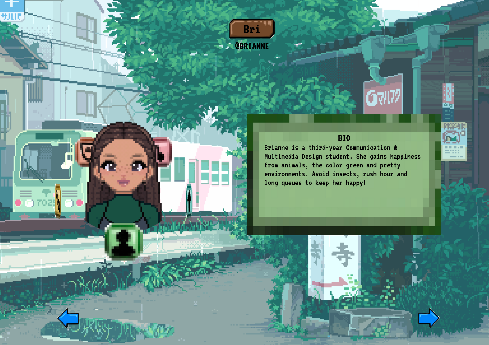

<!-- ☝️ replace this description with a description of your own work -->

# MY PERSONAL SITE - BRIANNE



Welcome to this interactive mini-site I built for the course Webapps From Scratch, meant to be a creative sort of introduction. In this work of mine, you'll find a pixelated version of me, surrounded by the things I feel introduce who I am as a person on a surface-level. The application's style is greatly inspired by infamous pixelated videogames like Stardew Valley, Pacman and Super Mario, and it is best viewed on a phone-format.

<!-- Add a nice poster image here at the end of the week, showing off your shiny frontend 📸 -->

<!-- Maybe a table of contents here? 📚 -->
## Table of Contents
- [How to Install](#howtoinstall)
- [Features and use](#featuresanduse)
- [External data source](#externaldatasource)
- [Achievements and let-go's](#achievements)
- [Version Log](#versionlog)
- [License](#license)
- [Sources](#sources)

<!-- How about a section that describes how to install this project? 🤓 -->
<a id="howtoinstall"></a>

## How to Install
1. Navigate to the [Code](https://github.com/briannededeugd/web-app-from-scratch-2324) tab of this repository.
2. Click the green button that says `Code` at the top right of the files section.
3. At the bottom of the dropdown that appears, click `Download ZIP`.
4. Open your computer's Finder (or its alternative, dependent on your operating system) and navigate to the folder you've downloaded the ZIP into, this is usually `Downloads` by default.
5. Locate the newly downloaded ZIP (its name will be `web-app-from-scratch-2324`) and unpack it.
6. Find the file `index.html` in the unpacked ZIP's `docs` folder, right-click this file and open with Chrome or Firefox.

There you go, now you've installed the app! For a better experience, navigate to the `Inspector` (right-click in your browser, click `Inspector`) and select the little devices icon at the top right of the inspector window. Then, pick a phonescreen size for the best user experience.

<!-- ...but how does one use this project? What are its features 🤔 -->
<a id="featuresanduse"></a>

## Features and use

The project is fairly straightforward in use! You'll be met with the sight of my mini-me, surrounded by a few icons we'll refer to as "elements". Each element has its own color and its own meaning, which we'll discover more about later. For now, focus on the blue arrows at the bottom of the screen - those are your navigation arrows!

By default, we're on the 'bio'-element, which we can also tell by the color of the information box. When we use our navigation arrows, the elements shift and rotate around 'my' head, and the information box updates accordingly.

Here's a description of each element:
1. BIO: Tells you about me and how to keep me happy;
2. STRENGTHS: A comprehensive list on things I'm good at (my strengths) as a character;
3. NATIVE: Shows what areas I am 'native' to;
4. SOUNDTRACK: A music player that plays the official Brianne soundtrack;
5. LEVEL: My age as a level progression, with little me running the race.

Additionally, all interactions are accompanied by their own sounds from the external data source (API)!

<a id="versionlog"></a>

## Version log

### _WAFS V1_ <br />
*February 5th, 2024*<br/>

Title: Initial code and project start.

Includes:
- Plan for design (sketch)
- Initial HTML setup
- Initial CSS setup
- Relevant file linking

### _WAFS V2_ <br/>
*February 6th, 2024*<br/>

Title: Main feature and 3D-elements.

Includes:
- Images of elements, drawn digitally by myself
- Rotation system in HTML
- Rotation system in CSS
- JS functions for making rotation interactive
	1. Variables for selecting HTML elements;
	2. Dynamic degrees en element positioning;
	3. updateElementRotation() function on button click

### _WAFS V3.1_ <br />
*February 7th, 2024*<br/>

Title: Dynamic information from dataset in frontend.

Includes:
- Images of more elements, drawn digitally by myself (information box, navigation buttons, name sign)
- Information box in HTML (including initially hidden elements)
- Updating the updateElementRotation() function to include a nextIndex to check the positioning of the element, and bring it back to 0 if it's the front again
- Adding the updateInformation() function that's called on inside of updateElementRotation(), that checks which element is at the front and loads its data
- Styling the body, global elements and added elements in CSS

### _WAFS V3.2_

Includes:
- Added the updateElementRotationBackward() function that reverses the updateElementRotation(), including the necessary event listener
- Updated the images of the information boxes (new drawings)

### _WAFS V4_ <br/>
*February 8th, 2024*<br/>

Title: Soundtrack, data transformation and API integration.

Includes:
- Integrating API by adding an API key, URLs with the token inside, then fetching the linked sound and playing it in updateElementRotation()
- Creating data.json
- Updating updateInformation() to handle arrays and arrays of objects
- Styling the data in information box (heading and text)
- Adding an audio to data folder
- Adding range, currentTime and duration in HTML for audio player (soundtrack)
- Styling audio player (colors, sizing, positioning)

### _WAFS V5_ <br />
*February 9th, 2024*<br/>

Title: Added favicon, music playing functionality.

Includes:
- Favicon
- Music playing functionality
	1. When song is loaded, display its duration;
	2. Calculate time in minutes and seconds (using Math.floor);
	3. Display the duration (function);
	4. Match song's current time with slider's value;
	5. Set slider max to match song's duration;
	6. Check song's readyState, display everything if it's loaded (so, ready);
	7. Change time on slider value change, change slider value on time change;
	8. Update song time and text on slider value change;
	9. Play and pause the song;
	10. Display audio player if the element at the front of the avatar is 'Soundtrack'

### _WAFS V6_ <br />
*February 11th, 2024*<br/>

Title: Display level and strengths uniquely and dynamically.

Includes:
- BUG FIX: Audio pauseable/playable even when user has rotated
- Data.json edited -> "strengths" to an array of strings
- Build custom leveldisplay in HTML (progressbar)
- Dynamic level text in JS, including current level and next level
- Level display styling in CSS
- Dynamic level display with JS
	1. Previous level is age;
	2. Next level is age + 1;
- Transforming data for frontend showing
	1. IF the current element is native:
		1. Initializing an empty string to the HTML;
		2. For each key and value, a string is added that looks like `${key}: ${value}`;
	2. ELSE IF it's strengths:
		1. Starting with an empty unordered list;
		2. Looping through each strength in the array and add it as a list item;
		3. Closing the unordered list;
		4. Setting the textContent of the information box's bodytext to the list;
	3. ELSE the textContent of the bodytext is equal to the category
- Level and Strengths styling in CSS

### _WAFS V7_ <br />
*February 12th, 2024*<br/>

Title: Responsiveness and team data

Includes:
- Adding grid/flex for small vs big screens
- Editing data.json to include teamdata

### _WAFS V8_ <br/>
*February 13th, 2024*<br/>

Title: Cleaning up

Includes:
- Changing data locations and paths
- Changing button looks and colors
- Editing data to streamline with team
- Adding clarifying comments

<!-- What external data source is featured in your project and what are its properties 🌠 -->
<a id="externaldatasource"></a>

## External data source

As an external data source (the API), I liked the idea of a sound library to add on to the video game experience. It could add sounds when the user interacts with the application and be an extra way to offer feedback to users. I Googled some free sound effects APIs and at last ended up with [Free Sound](https://freesound.org/), on which users can upload their own sounds.

I've implemented the API by signing up on the website and creating a new project. All I had to do next was share the URL of the website and clarify for what purposes I was intending to use the API, and then I was given an API key and a Client ID.

Normally, the API key shouldn't be pushed to Github, which can be guaranteed by storing it in something like a dotenv file. However, I couldn't use dotenv since I didn't build my webapp in an environment like node (I aimed to do as much vanilla as possible and stick to the file-architecture that was delivered with the repo). I discussed this with my coach Bas and since it's a public API, he suggested I skip the complexities and store the key in my script.js, as other people having access to it wouldn't be a problem.

So that's what I did! I read the documentation of the API and wrote the following code to make use of it:

```js
// API
const apiKey = "UGvJe4oBAcXQXhqsH80aSe7CwPk4r1cwKTrtP8Ai";

// Navigation sound effect
const navID = 106125;
const navURL = `https://freesound.org/apiv2/sounds/${navID}/?token=${apiKey}`;

// Shifting elements sound effect
const elementsID = 391250;
const elementsURL = `https://freesound.org/apiv2/sounds/${elementsID}/?token=${apiKey}`;

// Navigation sound effect
const likeID = 1234;
const likeURL = `https://freesound.org/apiv2/sounds/${likeID}/?token=${apiKey}`;

function playSound(url) {
	const audio = new Audio(url);
	audio
		.play()
		.catch((error) => console.error("Error playing the sound:", error));
}
```

In my navigation function, I then called on the shifting elements sound effect with the following code:

```js
fetch(elementsURL)
			.then((response) => response.json())
			.then((data) => {
				if (data && data.previews) {
					// Use the preview URL to play the sound
					playSound(data.previews["preview-hq-mp3"]);
				}
			})
			.catch((error) => console.error("Error fetching sound data:", error));
```

In this code, the ID's are special codes tied to their respective sound effects. So I first searched which sounds I wanted to use, and then looked for their ID and wrote the code! Additionally, I used `data.previews` as a way to still get the sound despite CORS-forbidden rules.

<!-- Maybe a checklist of done stuff and stuff still on your wishlist? ✅ -->
<a id="achievements"></a>

## Achievements and let-go's

One specific thing I really wanted to achieve was a 3D-circling effect. I don't know why, but for some reason this idea has been in my head for ages. It always seemed too complex and so I didn't really start it or implement it, ever (despite its permanent residence in my head), but this project seemed like the perfect chance to take the leap and just tackle it. Naturally, the first thing I'm very proud of is that

1. The 3D-effect works!

But I'm also proud of:

2. The stylistic (pixel) choices I've been able to streamline throughout the application;
3. The custom audio player and its thumb that I learned about in the first Weekly Nerd;
4. The way I've been able to handle different types of data (strings, numbers, arrays, objects) and made them work in my frontend;
5. The calculations with which I've made the rotation animation work smoothly;
6. The intuitive use of my API and the fact that it seamlessly works with user interactions;
7. The semantics of my HTML and organization of my CSS - as well as the comments in my JS.

There are also a few things that are not as perfect as I wished they'd be and I've had to keep on my wishlist. I call these

***The let-go's***
1. The strange jump on the first rotation, where the 3D-carousel just sort of skips an entire category;
2. The less-than-ideal desktop-version (the site is fully responsive, but the desktop-version feels like a bit much as there's so many things in one viewport. If I had more time, I would've done something about that);
3. A 'like'-button, I really liked the idea of tapping on a heart and having little hearts descend on the avatar, kind of like a way to give love or show appreciation. Again, considering the team-app I still had to do my part for, I've unfortunately had to let this go.

All in all, what I've achieved outweighs what I've had to let go, and I've ultimately made a cute webapp that captures the essence of who I am.

<!-- How about a license here? 📜 (or is it a licence?) 🤷 -->
<a id="license"></a>

## License

MIT License

Copyright (c) 2023 Brianne

Permission is hereby granted, free of charge, to any person obtaining a copy
of this software and associated documentation files (the "Software"), to deal
in the Software without restriction, including without limitation the rights
to use, copy, modify, merge, publish, distribute, sublicense, and/or sell
copies of the Software, and to permit persons to whom the Software is
furnished to do so, subject to the following conditions:

The above copyright notice and this permission notice shall be included in all
copies or substantial portions of the Software.

THE SOFTWARE IS PROVIDED "AS IS", WITHOUT WARRANTY OF ANY KIND, EXPRESS OR
IMPLIED, INCLUDING BUT NOT LIMITED TO THE WARRANTIES OF MERCHANTABILITY,
FITNESS FOR A PARTICULAR PURPOSE AND NONINFRINGEMENT. IN NO EVENT SHALL THE
AUTHORS OR COPYRIGHT HOLDERS BE LIABLE FOR ANY CLAIM, DAMAGES OR OTHER
LIABILITY, WHETHER IN AN ACTION OF CONTRACT, TORT OR OTHERWISE, ARISING FROM,
OUT OF OR IN CONNECTION WITH THE SOFTWARE OR THE USE OR OTHER DEALINGS IN THE
SOFTWARE.

<a id="sources"></a>

## Sources

1. CSS 3D transforms. (z.d.). https://www.w3schools.com/css/css3_3dtransforms.asp
2. CSS background image to fit width, height should auto-scale in proportion. (z.d.). Stack Overflow. https://stackoverflow.com/questions/9262861/css-background-image-to-fit-width-height-should-auto-scale-in-proportion
3. Eddymens. (2022, 11 juli). Markdown table of contents (TOC): how to create one. Tech Writing. Geraadpleegd op 7 februari 2024, van https://www.eddymens.com/blog/markdown-table-of-contents-toc-how-to-create-one
4. Get exact rotation angle from Matrix3D. (z.d.). Stack Overflow. https://stackoverflow.com/questions/24013335/get-exact-rotation-angle-from-matrix3d
5. How to get the RotateY value applied on an HTML element using Javascript? (z.d.). Stack Overflow. https://stackoverflow.com/questions/58092846/how-to-get-the-rotatey-value-applied-on-an-html-element-using-javascript
6. How to get value transform rotation in Javascript? (z.d.). Stack Overflow. https://stackoverflow.com/questions/65446958/how-to-get-value-transform-rotation-in-javascript
7. How to make the animation smooth? (z.d.). Stack Overflow. https://stackoverflow.com/questions/38895841/how-to-make-the-animation-smooth
8. How to read/parse individual transform style values in JavaScript? (z.d.). Stack Overflow. https://stackoverflow.com/questions/3432446/how-to-read-parse-individual-transform-style-values-in-javascript
9. Is the “GetPropertyValue” method required for retrieving CSS? (z.d.). Stack Overflow. https://stackoverflow.com/questions/31506401/is-the-getpropertyvalue-method-required-for-retrieving-css
10. JavaScript: Rotate IMG on click. (z.d.). Stack Overflow. https://stackoverflow.com/questions/19799846/javascript-rotate-img-on-click
11. NikhilsCode. (2023, 20 februari). Rotation button interaction with HTML, CSS & JavaScript. NikhilsCode. https://nikhilscode.com/rotation-button-interaction/
12. Onclick Rotation animation. (2023, 3 november). Inductive Automation Forum. https://forum.inductiveautomation.com/t/onclick-rotation-animation/81364/2
13. Rotate3D() - CSS: Cascading Style Sheets | MDN. (2023, 23 november). MDN Web Docs. https://developer.mozilla.org/en-US/docs/Web/CSS/transform-function/rotate3d
14. RotateY() - CSS: Cascading Style Sheets | MDN. (2023, 23 augustus). MDN Web Docs. https://developer.mozilla.org/en-US/docs/Web/CSS/transform-function/rotateY
15. Use CSS Transform rotateY() on a DIV element. (z.d.). Stack Overflow. https://stackoverflow.com/questions/19345197/use-css-transform-rotatey-on-a-div-element
16. Using JS to rotate the 3D model with button clicks. (2019, 29 juli). https://community.ptc.com/t5/Vuforia-Studio/Using-JS-to-rotate-the-3D-model-with-button-clicks/td-p/616254
17. VT323 - Google Fonts. (z.d.). Google Fonts. https://fonts.google.com/specimen/VT323
18. Why won’t .getPropertyValue() return a value for the “BorderRadius” property? (z.d.). Stack Overflow. https://stackoverflow.com/questions/10803023/why-wont-getpropertyvalue-return-a-value-for-the-borderradius-property
19. Window: GetComputedStyle() Method - Web APIs | MDN. (2024, 20 januari). MDN Web Docs. https://developer.mozilla.org/en-US/docs/Web/API/Window/getComputedStyle
