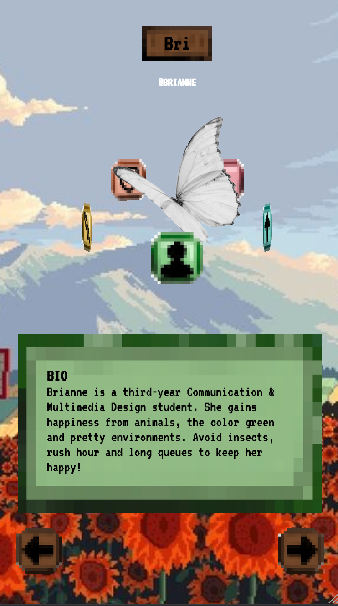
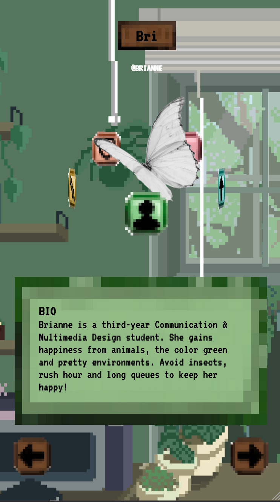
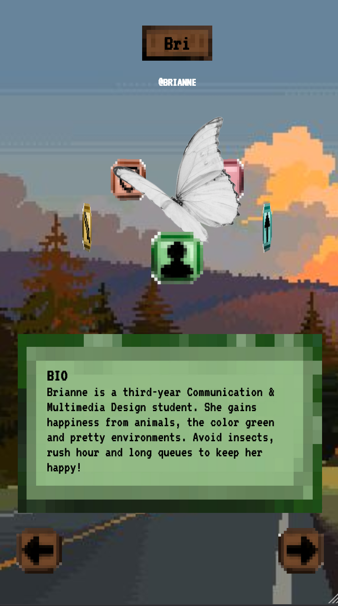
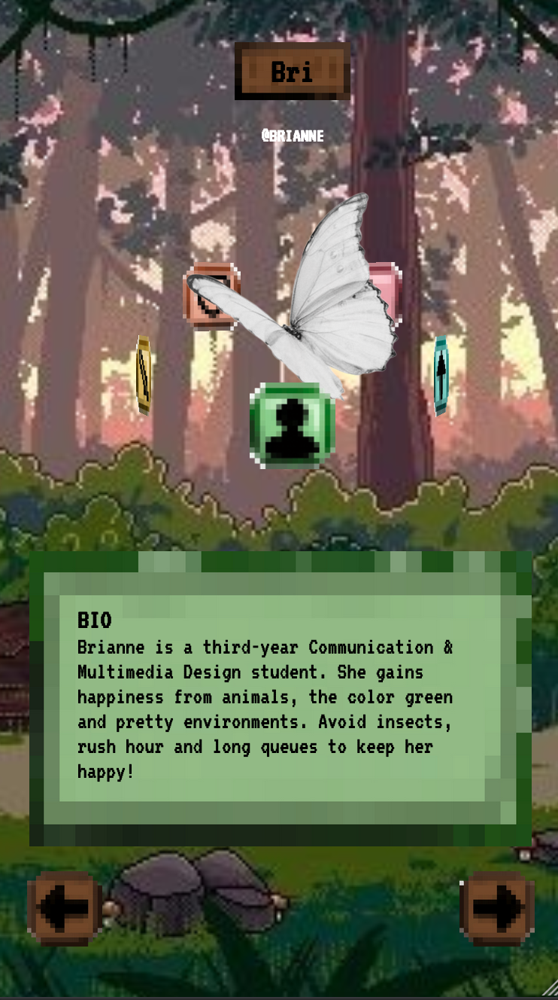
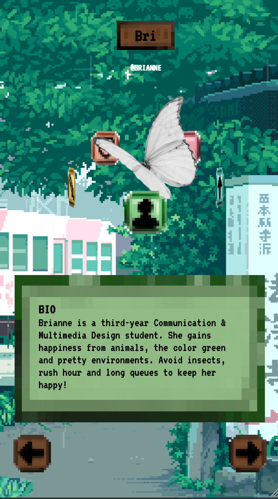

<!-- ☝️ replace this description with a description of your own work -->

# MY PERSONAL SITE - BRIANNE

Welcome to this interactive mini-site I built for the course Webapps From Scratch, meant to be a creative sort of introduction. In this work of mine, you'll find a pixelated version of me, surrounded by the things I feel introduce who I am as a person on a surface-level. The application's style is greatly inspired by infamous pixelated videogames like Stardew Valley, Pacman and Super Mario, and it is best viewed on a phone-format.

<!-- Add a nice poster image here at the end of the week, showing off your shiny frontend 📸 -->

<!-- Maybe a table of contents here? 📚 -->
## Table of Contents
- [How to Install](#howtoinstall)
- [Features and use](#featuresanduse)
- [External data source](#externaldatasource)
- [Achievements and let-go's](#achievements)
- [Process](#process)
- [License](#license)
- [Sources](#sources)

<!-- How about a section that describes how to install this project? 🤓 -->
<a id="howtoinstall"></a>

## How to Install
1. Navigate to the [Code](https://github.com/briannededeugd/web-app-from-scratch-2324) tab of this repository.
2. Click the green button that says `Code` at the top right of the files section.
3. At the bottom of the dropdown that appears, click `Download ZIP`.
4. Open your computer's Finder (or its alternative, dependent on your operating system) and navigate to the folder you've downloaded the ZIP into, this is usually `Downloads` by default.
5. Locate the newly downloaded ZIP (its name will be `web-app-from-scratch-2324`) and unpack it.
6. Find the file `index.html` in the unpacked ZIP's `docs` folder, right-click this file and open with Chrome or Firefox.

There you go, now you've installed the app! For a better experience, navigate to the `Inspector` (right-click in your browser, click `Inspector`) and select the little devices icon at the top right of the inspector window. Then, pick a phonescreen size for the best user experience.

<!-- ...but how does one use this project? What are its features 🤔 -->
<a id="featuresanduse"></a>

## Features and use

## Process
I've received some great feedback during this process! Here's my process, including what my teachers and peers have had to say about improving my app.
1. To start out, I wrote simple HTML to position all elements and drew some containers and icons in Procreate. I wanted to go for a pixelated, 8-bit videogame style, because our theme as a team was videogames. The first thing I focused on was the 3D-element I was planning to implement. Various online sources on 3D CSS taught me the semantics of containers and elements needed to achieve the effect I was going for. My HTML is quite simple:

```html
<section class="rotation">
	<section class="avatar">
		<!-- BIOGRAPHY -->
		<div class="bio"></div>

		<!-- LEEFTIJD/LEVEL -->
		<div class="level"></div>

		<!-- SOUNDTRACK -->
		<div class="soundtrack"></div>

		<!-- NATIVE (TO) -->
		<div class="native"></div>

		<!-- STRENGTHS -->
		<div class="strengths"></div>
	</section>
</section>
```

Next, I applied the necessary CSS. Because I wanted my elements/categories to 'revolve' around me, I used a placeholder of a butterfly as its background image.

```css
.rotation {
    margin: 0;
    height: max-content;
    display: flex;
    justify-content: center;
    align-items: center;
    perspective: 800px; /* Adjust the perspective for the 3D effect */
    perspective-origin: center;
}

.avatar {
    width: 200px;
    height: 200px;
    background-image: url("../img/butterfly.png");

    background-size: cover;
    border-radius: 50%;
    position: relative;
    transform-style: preserve-3d;
}

.avatar > div {
    width: 50px;
    height: 50px;
    position: absolute;
    background-repeat: no-repeat;
    background-size: cover;
}

.avatar > div {
    top: 50%;
    left: 50%;
    transition: transform 1s ease-in-out; 
}

/* Bio */
.avatar > div:nth-child(1) {
    background: url("../img/bio.png");
    background-repeat: no-repeat;
    background-size: cover;
    transform: translate(-50%, 100%) rotateY(0deg) translateZ(100px);
}

/* Level */
.avatar > div:nth-child(2) {
   background: url("../img/level.png");
    background-repeat: no-repeat;
    background-size: cover;
   transform: translate(-50%, 50%) rotateY(72deg) translateZ(100px);
}

/* ETC... */
```

It did seem a little strange that I had to keep adding `.avatar > div:nth-of-type(xx) {}` to apply the same styling multiple times, instead of defining the style once at `.avatar > div`, but unfortunately doing so didn't work. But the good news: the 3D-placing worked!<br />


2. To really lean into the pixel game style, I ventured to find a background image online of pixel art that fit my vision but wasn't overbearing. There were a few options: <br />


But the winner was a cute train station scenery in the rain:<br/>


3. Next, I wanted to have my own head as the avatar, or rather a pixelated avatar of myself. I was a bit hesitant to fully draw my own avatar, also because of how much effort it would take, but luckily I know of a website where you can easily create your own avatar: picrew. All it took was finding a 'pixel avatar maker'. Unfortunately, most avatar makers were only including straight hair and light skin, so I've had to settle for an avatar maker that offered braids and brown skin but no face customization. Regardless, I think she's cute! I made my avatar with [this picrew](https://picrew.to/6ed/image_maker/pixbabe_x0) and saved it as a png, so that the 3D-elements circling it would feel more natural:


However, I quickly noticed that a static image seemed a bit boring and wanted to add a small motion. I considered adding a wink, making her blink, or having hearts float around her face, but eventually decided on a simple gif: she smiles, stops smiling, and then puckers her lips, on a loop! Which you can see in the [live version of the site](https://briannededeugd.github.io/web-app-from-scratch-2324/)

4. EDIT: LOAD INFO ERROR, USE LIVE SERVER, SHOW DATA
The logical next step was to create and load the right data. For this, I had made a bunch of containers that were each linked (or would be linked in the future) to the correct element. The goal was that if a floating element was at the front of the avatar, its corresponding information(-container) would appear in the front.

However, having multiple containers for this seemed a bit much, and wasn't all that convenient considering the fact that I was able to dynamically load data - and I would be doing that, anyway, if I fetched my data from a JSON file.

So I made only one container, with a header, a text content and some invisible addons (like a music player for the Soundtrack element and a sort of progressbar for the Level element).

```html
<section class="information">
			<h3 id="infoname">BIO</h3>
			<p id="infotext">
				Brianne is a third-year Communication & Multimedia Design student. She
				gains happiness from animals, the color green and pretty environments.
				Avoid insects, rush hour and long queues to keep her happy!
			</p>

			<div id="leveldisplay" style="display: none">
				<span id="prevlevel"></span>
				<div id="levelcontainer">
					<div id="levelindicator"></div>
				</div>
				<span id="nextlevel"></span>
			</div>

			<div id="audio-player-container" style="display: none">
				<span id="songtitle">wave to earth - seasons</span>
				<div id="player">
					<button id="play-icon">
						
					</button>
					<span id="current-time" class="time">0:00</span>
					<input type="range" id="seek-slider" max="100" value="0" />
					<span id="duration" class="time">0:00</span>
				</div>
			</div>
		</section>
```

The default text is set to the bio information, as that's the first element in rotation, and it updates when a user navigates by clicking the 'Next' or 'Prev' button.

To achieve this functionality, I did a few things: 
- Created a data.json file;
- Created an updateInformation function that was called inside of the updateRotation function;
- Called on the right information from my data.json-file;
- Loaded the data in place of the header and text content;

There were a few issues I ran into, including the handling of the different data types (see number 6 in this list), but before all that, I ran into a problem: the data.json couldn't be fetched.

I was told that this was because I was working in my files and not on a server. Installing a Live Preview extension and running the application on a localhost resolved the issue.

Once I could fetch data, I filled my JSON-file:
```json
{
	"name": "Brianne",
	"nickname": "bri",
	"level": 20,
	"bio": "Brianne is a third-year Communication & Multimedia Design student. She gains happiness from animals, the color green and pretty environments. Avoid insects, rush hour and long queues to keep her happy!",
	"strengths": "Brianne performs well under pressure.",
	"native": [
		{ "Born": "Alkmaar" },
		{ "Living": "Almere" },
		{ "Frequents": "Amsterdam" }
	],
	"soundtrack": "Play the official Brianne soundtrack below!",
	"favorite_game": ["The Sims", "Minecraft", "Super Mario Bros", "Killer Sudoku"]
}
```

Then, I fetched it:
```js
let data = {};

async function fetchData() {
	const response = await fetch("./data/data.json");
	data = await response.json();
	console.log("THE DATA:", data);
}

fetchData();
```

And then, I could work with it!
```js
function updateInformation(elementKey, currentDegree) {
	// Check if the currentDegree is 0
	if (currentDegree === 0) {
		// Update the background-image of .information based on the elementKey
		const category = data[elementKey];
		infoHeading.textContent = elementKey.toUpperCase();
		if (Array.isArray(category)) {
			let fullHtml = ""; // Initialize an empty string to accumulate the HTML content
			category.forEach((livingInfo) => {
				for (const [key, value] of Object.entries(livingInfo)) {
					fullHtml += `${key}: ${value}<br />`; // Append each key-value pair with a line break
				}
			});
			infoText.innerHTML = fullHtml; // Set the innerHTML to include line breaks
		} else {
			infoText.textContent = category;
		}

		const imageUrl = backgroundImageMapping[elementKey];
		if (imageUrl) {
			// First check if imageUrl exists
			information.style.backgroundImage = imageUrl;
		}

		if (elementKey === "soundtrack") {
			musicPlayer.style.display = "block";
			playButton.addEventListener("click", function () {
				playSong();
			});
		} else {
			musicPlayer.style.display = "none";
		}

		if (elementKey === "level") {
			levelDisplay.style.display = "flex";
			prevLevel.textContent = category;
			nextLevel.textContent = `${category + 1}`;
			infoText.textContent = `Brianne is currently at level ${category}!`;
		} else {
			levelDisplay.style.display = "none";
		}

		fetch(elementsURL)
			.then((response) => response.json())
			.then((data) => {
				if (data && data.previews) {
					// Use the preview URL to play the sound
					playSound(data.previews["preview-hq-mp3"]);
				}
			})
			.catch((error) => console.error("Error fetching sound data:", error));
	}
}
```

5. I'd already made some quick navigation buttons in the process, but when I spoke to Vasilis on February 8th, he remarked that the "next" and "previous" buttons as well as the name plaque on the top should be easier to read / more obvious, so that they don't blend into the background too much and so that it's clear to the user that they can interact with the elements. He suggested I add a 'light' around them, like a luminent glow that pixel games have sometimes. Before implementing his feedback, the buttons looked like this:<br />


And after, they looked like this: <br />

Much better!

6.  The data of the 'Native' category can get pretty complex, because it's an array of objects of which I want the property key as well as the value in my frontend, but I only have one paragraph to fill. My issue was that the data was loading, but it only displayed the last object in the Native array. I fixed this by adding an empty string to accumulate the HTML content, so that each collected object could get added to the frontend, and the different objects got added up, rather than being replaced by each other. <br />

The issue and the code: <br/>


```js
const category = data[elementKey];
if (Array.isArray(category)) {
	console.log(category, "is an array");
	category.forEach((livingInfo) => {
		for (const [key, value] of Object.entries(livingInfo)) {
			console.log(`${key}: ${value}`);
			infoText.textContent = `${key}: ${value}`;
		}
	});
	infoHeading.textContent = elementKey;
}
```

The fix and its code: </br>


```js
if (Array.isArray(category)) {
			let fullHtml = ""; // Initialize an empty string to accumulate the HTML content
			category.forEach((livingInfo) => {
				for (const [key, value] of Object.entries(livingInfo)) {
					fullHtml += `${key}: ${value}<br />`; // Append each key-value pair with a line break
				}
			});
			infoText.innerHTML = fullHtml; // Set the innerHTML to include line breaks
		} else {
			infoText.textContent = category;
		}
```
5. AUDIO CUSTOM SLIDER PLAYER ETC
6. LEVEL YAYAYAY
7. EXTERNAL API

<!-- What external data source is featured in your project and what are its properties 🌠 -->
<a id="externaldatasource"></a>

## External data source

<!-- Maybe a checklist of done stuff and stuff still on your wishlist? ✅ -->
<a id="achievements"></a>

## Achievements and let-go's

<a id="process"></a>

<!-- How about a license here? 📜 (or is it a licence?) 🤷 -->
<a id="license"></a>

## License

<a id="sources"></a>

## Sources

1. CSS 3D transforms. (z.d.). https://www.w3schools.com/css/css3_3dtransforms.asp
2. CSS background image to fit width, height should auto-scale in proportion. (z.d.). Stack Overflow. https://stackoverflow.com/questions/9262861/css-background-image-to-fit-width-height-should-auto-scale-in-proportion
3. Eddymens. (2022, 11 juli). Markdown table of contents (TOC): how to create one. Tech Writing. Geraadpleegd op 7 februari 2024, van https://www.eddymens.com/blog/markdown-table-of-contents-toc-how-to-create-one
4. Get exact rotation angle from Matrix3D. (z.d.). Stack Overflow. https://stackoverflow.com/questions/24013335/get-exact-rotation-angle-from-matrix3d
5. How to get the RotateY value applied on an HTML element using Javascript? (z.d.). Stack Overflow. https://stackoverflow.com/questions/58092846/how-to-get-the-rotatey-value-applied-on-an-html-element-using-javascript
6. How to get value transform rotation in Javascript? (z.d.). Stack Overflow. https://stackoverflow.com/questions/65446958/how-to-get-value-transform-rotation-in-javascript
7. How to make the animation smooth? (z.d.). Stack Overflow. https://stackoverflow.com/questions/38895841/how-to-make-the-animation-smooth
8. How to read/parse individual transform style values in JavaScript? (z.d.). Stack Overflow. https://stackoverflow.com/questions/3432446/how-to-read-parse-individual-transform-style-values-in-javascript
9. Is the “GetPropertyValue” method required for retrieving CSS? (z.d.). Stack Overflow. https://stackoverflow.com/questions/31506401/is-the-getpropertyvalue-method-required-for-retrieving-css
10. JavaScript: Rotate IMG on click. (z.d.). Stack Overflow. https://stackoverflow.com/questions/19799846/javascript-rotate-img-on-click
11. NikhilsCode. (2023, 20 februari). Rotation button interaction with HTML, CSS & JavaScript. NikhilsCode. https://nikhilscode.com/rotation-button-interaction/
12. Onclick Rotation animation. (2023, 3 november). Inductive Automation Forum. https://forum.inductiveautomation.com/t/onclick-rotation-animation/81364/2
13. Rotate3D() - CSS: Cascading Style Sheets | MDN. (2023, 23 november). MDN Web Docs. https://developer.mozilla.org/en-US/docs/Web/CSS/transform-function/rotate3d
14. RotateY() - CSS: Cascading Style Sheets | MDN. (2023, 23 augustus). MDN Web Docs. https://developer.mozilla.org/en-US/docs/Web/CSS/transform-function/rotateY
15. Use CSS Transform rotateY() on a DIV element. (z.d.). Stack Overflow. https://stackoverflow.com/questions/19345197/use-css-transform-rotatey-on-a-div-element
16. Using JS to rotate the 3D model with button clicks. (2019, 29 juli). https://community.ptc.com/t5/Vuforia-Studio/Using-JS-to-rotate-the-3D-model-with-button-clicks/td-p/616254
17. VT323 - Google Fonts. (z.d.). Google Fonts. https://fonts.google.com/specimen/VT323
18. Why won’t .getPropertyValue() return a value for the “BorderRadius” property? (z.d.). Stack Overflow. https://stackoverflow.com/questions/10803023/why-wont-getpropertyvalue-return-a-value-for-the-borderradius-property
19. Window: GetComputedStyle() Method - Web APIs | MDN. (2024, 20 januari). MDN Web Docs. https://developer.mozilla.org/en-US/docs/Web/API/Window/getComputedStyle
